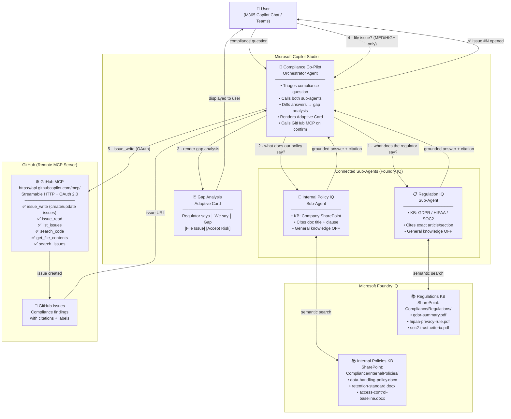
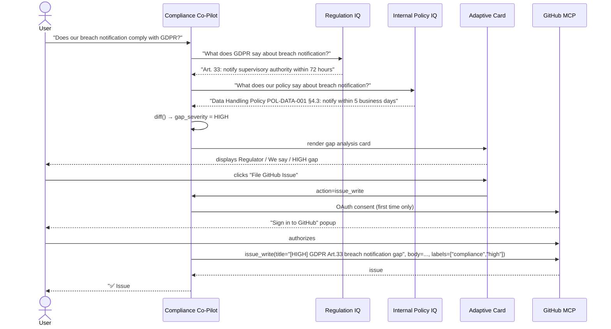

# Architecture — Policy Compliance Co-Pilot

## Overview

The solution is a three-agent system built entirely on Microsoft Copilot Studio (no custom backend). An orchestrator agent delegates to two Foundry IQ-powered sub-agents, diffs their answers, and surfaces the result through an Adaptive Card with an optional GitHub write-action over OAuth MCP.

---

## System Diagram

---

## Component Descriptions

### Compliance Co-Pilot (Orchestrator)

The entry point for all user interactions. Its system instructions drive the full multi-step flow:

1. Call **Regulation IQ** for the regulatory stance (with clause citation).
2. Call **Internal Policy IQ** for the company stance (with doc citation).
3. Diff the two answers → produce a structured gap analysis: `topic`, `regulation_name`, `regulator_clause`, `internal_clause`, `gap_severity` (LOW / MED / HIGH), `recommendation`.
4. Render the **Gap Analysis Adaptive Card**.
5. If severity is MED or HIGH, offer to file a GitHub issue.
6. On user confirmation, call `issue_write` via the GitHub MCP server.

**Channels:** Teams, Microsoft 365 Copilot  
**Auth:** Integrated / Always (Microsoft Entra ID)  
**Schema name:** `cr47b_agent`

---

### Regulation IQ (Sub-Agent)

| Property | Value |
|---|---|
| Schema name | `new_RegulationIQ` |
| Knowledge source | Foundry IQ → SharePoint `Compliance/Regulations/` |
| Documents | `gdpr-summary.pdf`, `hipaa-privacy-rule.pdf`, `soc2-trust-criteria.pdf` |
| General knowledge | Disabled (`useModelKnowledge: false`) |
| Instruction | Quote exact article/section. Never speculate beyond cited text. |
| Hand-off trigger | _"Answers questions about external regulations (GDPR, HIPAA, SOC2). Always cites the exact article, section, and document name."_ |

---

### Internal Policy IQ (Sub-Agent)

| Property | Value |
|---|---|
| Schema name | `new_InternalPolicyIQ` |
| Knowledge source | Foundry IQ → SharePoint `Compliance/InternalPolicies/` |
| Documents | `data-handling-policy.docx`, `retention-standard.docx`, `access-control-baseline.docx` |
| General knowledge | Disabled (`useModelKnowledge: false`) |
| Instruction | Quote exact clause + document title. Never invent policy text. |
| Hand-off trigger | _"Answers questions about the company's internal policies. Always cites the exact document name, section number, and clause."_ |

---

### GitHub MCP Server

| Property | Value |
|---|---|
| Endpoint | `https://api.githubcopilot.com/mcp/` |
| Transport | Streamable HTTP |
| Authentication | OAuth 2.0 — user identity (Copilot Studio brokers the handshake) |
| Connection reference | `cr47b_agent.shared_github.a73a0ba95f4a47109aeb3c2e8bbd83a0` |
| Enabled tools | `issue_write`, `issue_read`, `list_issues`, `search_code`, `get_file_contents`, `search_issues`, `get_me`, `list_pull_requests`, `pull_request_read`, `search_pull_requests` |
| Token storage | Per-user, managed by Copilot Studio (silent on subsequent calls) |

---

### Gap Analysis Adaptive Card

Rendered inline in Copilot Chat. Contains:

- **Three-column table:** Regulator clause / Internal clause / Gap severity badge
- **Recommendation** text block
- **Action buttons:**
  - `📌 File GitHub Issue` → submits `create_issue` with `[SEVERITY]` prefixed title, both citations in body, labels `["compliance", severity]`
  - `✅ Mark as accepted risk` → closes the card flow

 The `adaptive-cards/gap-analysis-card.json` file in the repository documents the intended Adaptive Card layout .

---

## Data Flow — Detailed Sequence

---

## Intentional Compliance Gap (Demo Scenario)

The demo plants a deliberate mismatch in the knowledge bases:

| | GDPR Article 33 | Internal Policy §4.3 (POL-DATA-001) |
|---|---|---|
| **Breach notification deadline** | 72 hours | 5 business days |
| **Severity** | HIGH | — |
| **Recommendation** | Update policy to require 72-hour notification or shorter |

This gap is reliable, verifiable, and immediately understandable to any audience — making it ideal for a live demo.

---

## Security & Safety Controls

| Control | Implementation |
|---|---|
| Authentication | Microsoft Entra ID (Integrated/Always) |
| GitHub OAuth | User-identity flow; token stored per-user by Copilot Studio |
| Least-privilege | Only issue and search tools enabled; no repo admin or delete operations |
| Grounding | Foundry IQ with general knowledge disabled on both sub-agents |
| Content moderation | Copilot Studio content safety at High |
| No PII in issues | Orchestrator instruction explicitly prohibits including PII in filed issues |
